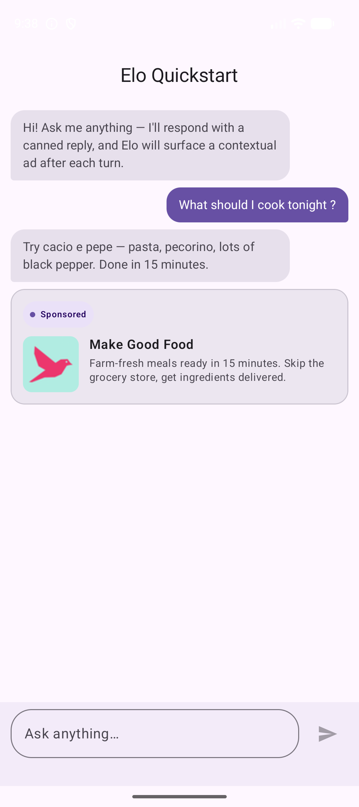
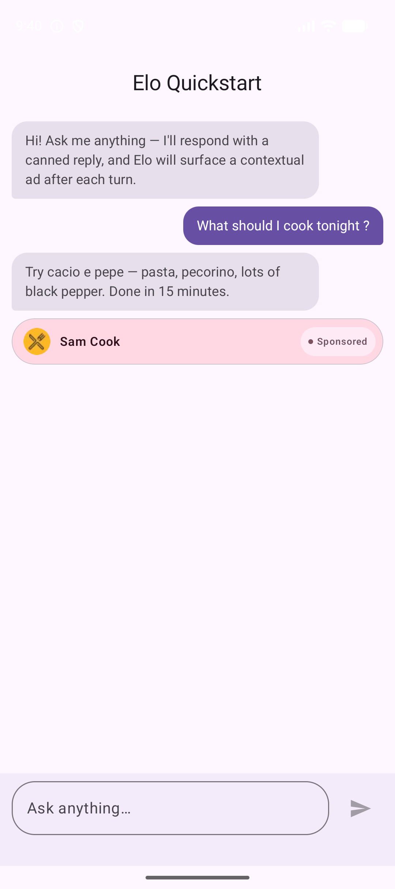
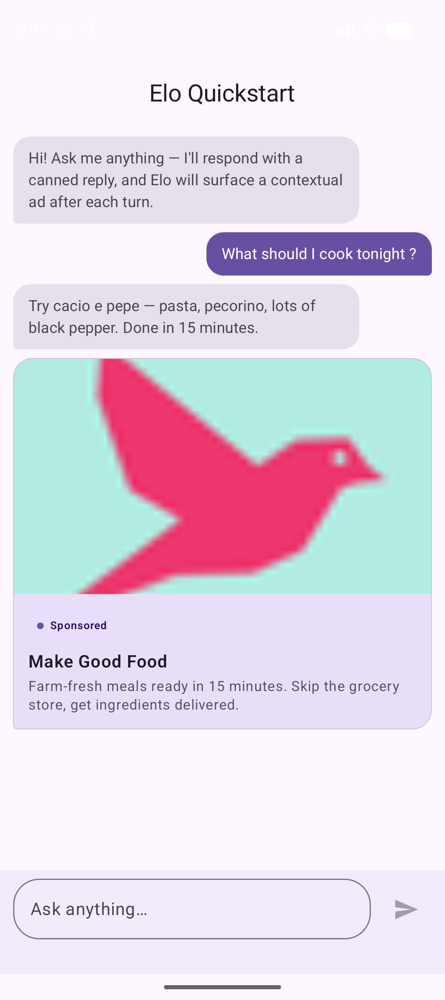

# Elo Android SDK

> Maven coordinates: `ad.elo:elo-android-sdk:2.3.0` — see [Installation](#installation).

Contextual ads for Android chat apps. Distributed via Maven Central.

## Requirements

- Android API 26+ (`minSdk = 26`)
- Kotlin 2.0+
- Compile against API 36+

## Installation

Add to your app module's `build.gradle.kts`:

```kotlin
dependencies {
    implementation("ad.elo:elo-android-sdk:2.3.0")
}
```

Maven Central is enabled by default. If your project uses a custom dependency-resolution config, ensure `mavenCentral()` is in the repositories list.

## Quick Start

```kotlin
class MainActivity : ComponentActivity() {
    override fun onCreate(savedInstanceState: Bundle?) {
        super.onCreate(savedInstanceState)
        Growl.initialize(
            context = this,
            publisherId = "YOUR_PUBLISHER_ID",
            adUnitId = "YOUR_AD_UNIT_ID",
        )
        setContent { MaterialTheme { ChatScreen() } }
    }
}

@Composable
fun ChatScreen() {
    var ad by remember { mutableStateOf<AdResult?>(null) }
    val scope = rememberCoroutineScope()
    val messages = listOf(
        ChatMessage(MessageRole.USER, "What's a quick weeknight pasta recipe?"),
    )
    Column {
        Button(onClick = {
            scope.launch { ad = Growl.loadAd(messages) }
        }) { Text("Load ad") }

        ad?.let { result ->
            GrowlAdView(result = result, modifier = Modifier.fillMaxWidth())
        }
    }
}
```

`GrowlAdView` lives in `com.withgrowl.growlandroidsdk.ui` and renders nothing on `AdResult.NoFill` / `AdResult.Error`, so it is safe to leave in the tree unconditionally.

## Ad formats

Three Compose ad views ship in `com.withgrowl.growlandroidsdk.ui`. Pass an `AdResult` to any of them.

| Standard (`GrowlAdView`) | Badge (`GrowlBadgeAdView`) | Chat (`GrowlChatAdView`) |
| :---: | :---: | :---: |
|  |  |  |
| Horizontal card with thumbnail, headline, and description. | Compact pill-style row that fits inline between messages. | Tall card with a prominent image — feels like a chat-feed post. |

All three auto-fire render telemetry on first composition and impression telemetry once the view is ≥50% visible for one continuous second.

## Mediation (optional)

Elo runs a parallel first-price auction across its own demand and any mediation adapters you register. Adapters are extra dependencies — add only the networks you actually want bidding.

The first-party AdMob adapter is published as a separate artifact:

```kotlin
dependencies {
    implementation("ad.elo:elo-android-sdk:2.3.0")
    implementation("ad.elo:elo-android-mediation-admob:0.0.3")
}
```

AdMob's Play Services SDK requires its app ID in your manifest. Add it once:

```xml
<application>
    <meta-data
        android:name="com.google.android.gms.ads.APPLICATION_ID"
        android:value="ca-app-pub-XXXXXXXXXXXXXXXX~YYYYYYYYYY" />
</application>
```

Then switch from `Growl.initialize` to `Growl.configure` so you can pass an `adapters` list:

```kotlin
import ad.elo.mediation.admob.AdMobNetworkAdapter

Growl.configure(
    context = this,
    configuration = GrowlConfiguration(
        growl = GrowlNetworkConfiguration(
            publisherId = "YOUR_PUBLISHER_ID",
            adUnitId = "YOUR_AD_UNIT_ID",
        ),
        adapters = listOf(
            AdMobNetworkAdapter(
                adUnitId = "ca-app-pub-…/…",
                // Optional: override the attribution chip for non-English markets.
                // sponsoredLabel = "Werbung",
            ),
        ),
    ),
)
```

The ad unit you provide is yours — configure floors and any AdMob-side mediation in your AdMob dashboard. The adapter loads that single unit on every bid.

`AdView` rendering, click tracking, and impression telemetry are unchanged — adapter creatives surface through the same `GrowlAdView` / `GrowlBadgeAdView` / `GrowlChatAdView` components.

The AdMob adapter ships from the same SDK release pipeline. To request additional networks, [open an integration question](https://github.com/growlads/elo-android-sdk/issues/new?template=integration_question.yml).

## Sample

A runnable Compose sample lives in [`samples/quickstart/`](./samples/quickstart). It pairs the SDK with a small canned-reply chat UI so you can see the contextual ad surface after each turn. The sample wires the AdMob mediation adapter alongside Elo's own demand, so you can observe the parallel auction end-to-end. Build it with:

```sh
cd samples/quickstart
./gradlew :app:assembleDebug
```

The sample reads publisher / ad-unit IDs from a gitignored `local.properties` file at `samples/quickstart/local.properties` — drop in your own without committing them:

```properties
growl.publisherId=YOUR_PUBLISHER_ID
growl.adUnitId=YOUR_AD_UNIT_ID
admob.appId=ca-app-pub-XXXXXXXXXXXXXXXX~YYYYYYYYYY
admob.adUnitId=ca-app-pub-XXXXXXXXXXXXXXXX/YYYYYYYYYY
```

Without `local.properties`, the sample builds with placeholder IDs (compile-only — Elo demand will no-fill, and the AdMob adapter is not registered until you provide a real `admob.adUnitId`).

## Styling

```kotlin
GrowlAdView(
    result = result,
    style = GrowlAdStyle(
        cornerRadius = 16.dp,
        // see GrowlAdStyle for the full set of tunables (colors, padding, typography weights)
    ),
)
```

## Docs

Full documentation: [elo.ad/docs/android](https://elo.ad/docs/android)

## Support

- **Bugs:** [open an issue](https://github.com/growlads/elo-android-sdk/issues/new?template=bug_report.yml)
- **Integration questions:** [open an issue](https://github.com/growlads/elo-android-sdk/issues/new?template=integration_question.yml)
- **SDK source changes:** for fixes or features in the SDK itself, contact the team — this repo does not accept code PRs against the SDK source (which is closed).

## License

The sample app and documentation in this repository are MIT licensed (see [LICENSE](./LICENSE)). The Elo Android SDK binary distributed via Maven Central is governed by the commercial license declared in the artifact's POM.
